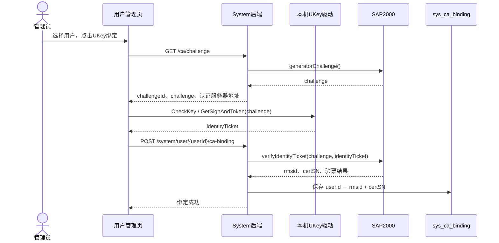
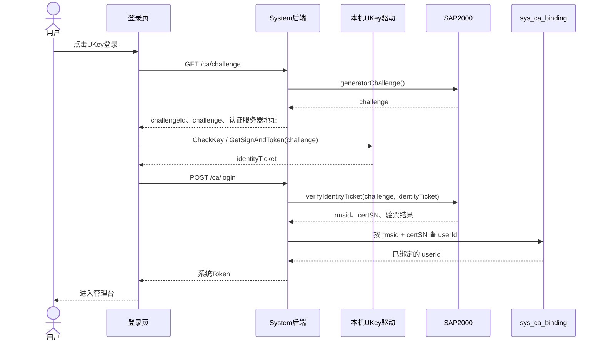

# SAP2000 UKey 登录联调

登录页新增“UKey 登录”，用户管理的“更多”菜单新增“UKey 绑定”。先在数据库执行 MySQL 版 [`Sql/ca_ukey_binding.sql`](../Sql/ca_ukey_binding.sql) 或人大金仓版 [`Sql/ca_ukey_binding_kingbase.sql`](../Sql/ca_ukey_binding_kingbase.sql)。挑战值在 Redis 中保存 120 秒，同一挑战值只能提交一次。

绑定时，管理员选中系统用户，浏览器调用本机驱动取得票据，后端向 SAP2000 验票后把结果中的 `userinfo/rmsid` 与 `userinfo/certSN` 绑定到用户。登录时重复验票，再用这两个标识查绑定表，取得本地用户及权限，签发系统令牌。解绑后该 UKey 不能再发起登录；已签发的会话令牌仍按原有过期机制处理。

## 调用时序





模拟模式由后端直接产生挑战值并验证模拟票据，图中的 SAP2000 调用不会发生；其他步骤相同。

## Mac 本地模拟

模拟模式可以在 `application.yml` 的 `ca.mock-enabled` 设置，也可以用环境变量覆盖；启动后端仍需项目原有的 `JASYPT_ENCRYPTOR_PASSWORD`。

```sh
export CA_MOCK_ENABLED=true
# 继续使用项目原有的后端启动命令
```

模拟驱动返回 `MOCK:<本次挑战值>`，模拟服务端只接受对应的票据。`MOCK-RMS-001` 和 `MOCK-CERT-001` 仅表示同一把虚拟 UKey，**没有默认绑定任何用户**。先用管理员账号在用户管理中选择一个测试用户并完成“UKey 绑定”，再退出并用登录页的 UKey 选项登录；未绑定时登录会被拒绝。请仅在本机开发环境开启，并让前后端开发服务只允许本机访问。修改配置后需要重启后端。前端无需安装驱动。

## Windows 真实联调

关闭模拟模式，配置厂商提供的连接信息：

```sh
export CA_MOCK_ENABLED=false
export CA_WSDL_URL='http://认证服务地址/services/testWS?wsdl'
export CA_APP_SERVER_ID='RMS分配的应用服务ID'
export CA_SERVER_IP='认证服务器IP'
export CA_SERVER_PORT=9021
```

安装资料目录中的客户端驱动和 UKey，确认本机 `ws://127.0.0.1:31018` 可连接。前端按厂商示例调用 `CheckKey` 和 `GetSignAndToken`，后端通过厂商 Java 客户端调用 `generatorChallenge` 与 `verifyIdentityTicket`。

验票结果必须包含匹配的挑战值、成功的 `result`、空的 `error`，以及 `userinfo/rmsid`、`userinfo/certSN`。如果厂商成功值不在默认的 `0,success,true` 中，可设置 `CA_SUCCESS_RESULTS`。正式接入前还需与厂商确认验票结果 `signature` 的验证算法与公钥；目前代码依赖对 SAP2000 服务连接的信任，尚未独立验证该签名。
